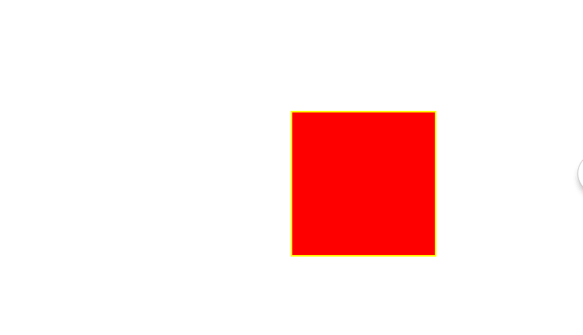

### 其效果图如下：
  https://zhijs.github.io/web/cube

### css3实现自由摆动的立方体
实现立方体，主要用到的css3动画属性有  
 <ol>
 
 <li><p>translateX(a )/ translateY(a )/translateZ(a)</p> 
<p>分别是往x,y,z方向移动a像素的距离</p>
</li>
<li>
<p>rotateX(deg) / rotateY(deg)/ rotateZ(deg) </p>
<P>分别表示沿x,y,z轴旋转，正值为顺时针方向，负值为逆时针方向</P>
</li>
<li>
  animation属性
  <p>指定动画</p>
</li>
</ol>

###  如何定义动画
动画通过
<p>@keyframes 动画名称
{  
  动画过程
 
}
来定义
</p>
#### 实现立方体第一步
#### 构造立方体
首先将六个面置于重合的位置 eg:如下图所示  
  
接下来分别构造各个面，例如顶面可以看成是由正面沿x轴顺时针方向旋转90度，然后沿y轴负方向平移高度的一半，再沿z轴负方向平移高度的一半，从而得到顶面    
代码为
```
 .face2{
	background:green;
	transform:translateY(-50%) translateZ(-90px) rotateX(90deg) rotateY(0) ;
} 
```
结果如下图所示    
![images]images/b.png)  
同理可以构造出其他的各个面。  

### 将包含这些面的容器应用动画，使其沿x,y,z轴旋转。  
#### 代码如下  
```
 index.html
 <!DOCTYPE html>
<html>
<head>
	<title>css3 立方体</title>
	<meta charset='utf-8'/>
	<link rel="stylesheet" type="text/css" href="style/cube.css"/>
</head>
<body>
    <div class="contain">
    	<div class="cube">
    	   <figure class='face1'>1</figure>
    	   <figure class='face2'>2</figure>
    	   <figure class='face3'>3</figure>
    	   <figure class='face4'>4</figure>
    	   <figure class='face5'>5</figure>
    	   <figure class='face6'>6</figure>
    	</div>
    </div>
</body>
</html>
```
### 其主要css代码如下  
```
*{
	margin:0;
	padding: 0;
}  
.contain{
	width: 100%;
	height: 100%;
	position: relative;
	background: #230;

}  

.cube{
	width:120px;
	height: 120px;
	margin-top:100px;
	position: absolute;
	top:50%;
	left: 50%;
	transform-style:preserve-3d;
	transform:translate(-50%,50%);
	animation:rote 4s infinite linear;
}  


.cube figure{  
	width:180px;
	height: 180px;
	position: absolute;
	text-align:center;	
	border:2px solid #ff0;
	line-height: 180px;/*行高设置成和容器一样高，实现文字的上下居中*/
	font-size: 120px;
	font-weight: bold; /*字体加粗*/

}


.face1{
	background:red;
	transform:translateZ(0) rotateX(0) rotateY(0);
}

.face2{
	background:green;
	transform:translateY(-50%) translateZ(-90px) rotateX(90deg) rotateY(0) ;
}  
.face3{
	background:yellow;
	transform:translateY(0) translateZ(-90px) translateX(50%)  rotateX(0) rotateY(90deg) ; 
}  
.face4{
	background:blue;
	transform:translateY(50%) translateZ(-90px) translateX(0)  rotateX(90deg) rotateY(0) ; 
}  
.face5{
	background:gray;
	transform:translateY(0) translateZ(-90px) translateX(-50%)  rotateX(0) rotateY(90deg) ; 
}    

.face6{
	background:purple;
	transform:translateY(0) translateZ(-180px) translateX(0)  rotateX(0) rotateY(0) ; 
}  

@keyframes rote
{
	from{
		transform:translateZ(-100px) rotateX(0) rotateY(0) rotateZ(0);
	}
	to{
		transform:translateZ(-100px) rotateX(360deg) rotateY(360deg) rotateZ(360deg);
	}
}
```
### 注意：translate必须放在roate前面申明，translateZ()不能传百分比
