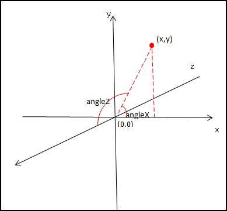

### css3实现圆圈进度条
<br/>
### 实现原理
<br/>
#### 首先圆圈进度条是一直在旋转的，旋转我们可以利用的是css3的rotate(deg)实现
<br/>
### rotate(deg):
一个二维旋转的css3属性，作用是将指定元素旋转指定的角度,正值表示顺时针方向旋转，负值表示逆时针防线旋转，旋转的角度范围为(-360deg~360deg)。
<br/>
一般的进度条的是长这样的
;
<br/>
这可以看成是一个圆弧在一直旋转，html中没有圆形标签，都是方形的，但可以通过设置border-radius将容器变为圆形，然后旋转即可
### 关键样式
```
@keyframes load{  //这里设置动画，使容器旋转一周
from{
	transform:rotate(0deg);
}
to{
    transform:rotate(360deg);
}
}
.loading{
	width:120px;
	height:120px;
	position: absolute;
	top:50px;
	left: 50%;
	margin-left: -60px;
	/*
	  设置为圆形形状
	  为了看到其中的一段旋转的效果，这里将其他边的透明度设置为0.4，从而隐藏了其他的边
	*/
	border-radius: 50%;
	border-top: 15px solid rgb(255,255,255,1);  
	border-left: 15px solid rgb(255,255,255,0.4);
	border-right: 15px solid rgb(255,255,255,0.4);
	border-bottom: 15px solid rgb(255,255,255,0.4);
	animation:load 2s infinite linear;

}
```

### 扩展
<br/>
roate的三维实现样式有
<br/>　
- rotateX(deg) //绕x轴旋转
- rotateY(deg) //绕Y轴旋转
- rotateZ(deg) //绕Z轴旋转
<br/>　
#### 在应用3d动画使，必须在所在元素样式中申明 transform-style: preserve-3d
<br/>　
#### 其坐标系统图如下所示
<br/>　
;
  
;
  
